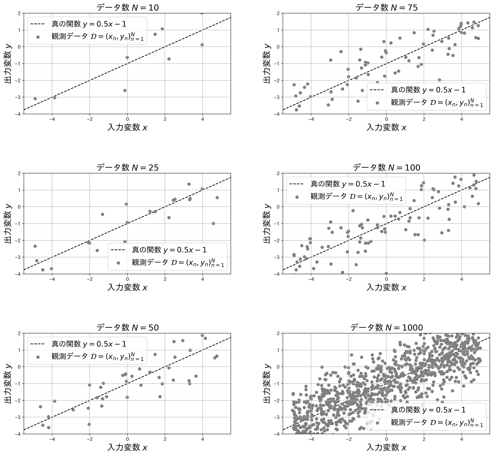
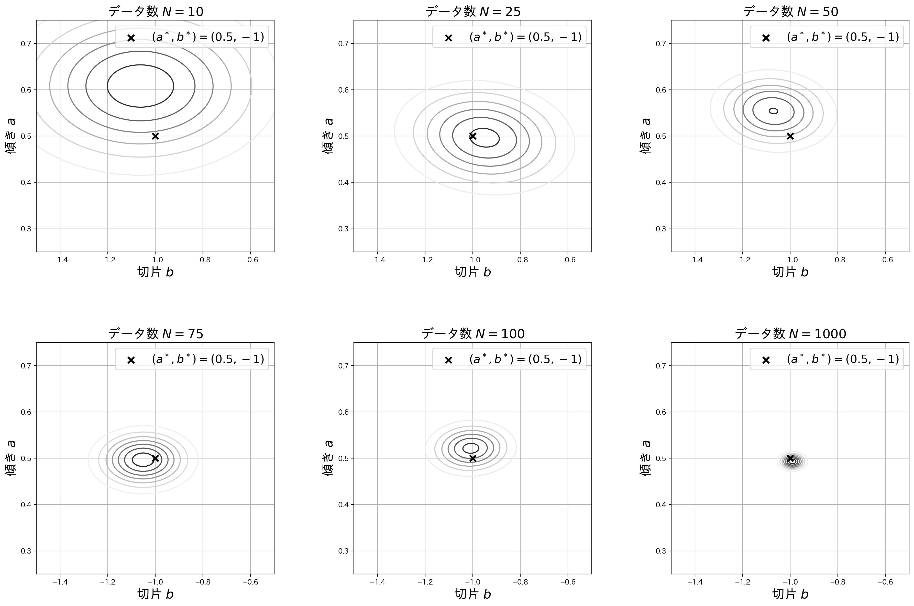

修士論文審査の前日にして，特に発表には関係のない記事を書きました．
僕には，試験前，締め切り前，など切羽詰まった課題の前に立たされると，その課題以外の課題に猛烈に興味を持ったり，普段は開かない，随分前に読んだ本を手に取り，ついつい読んでしまうことが多々あります．
今日もそんな感じです．

この記事では，ベイズ線形回帰を紹介します．
線形回帰モデルとは，$d\in\mathbb N$ 次元入力 $\bm x\in\mathbb R^d$ と回帰係数 $\bm w^d$ の線形結合で実数出力 $y\in\mathbb R$ を予測するモデルで，ノイズを $\epsilon\in\mathbb R$ として，以下の関係を仮定します．

$$
    y = \bm w^T\bm x + \epsilon \tag{1}
$$

これは，$d=1$ のとき「**単回帰**」，$d=2$以上のとき「**重回帰**」と呼ばれるモデルです．
また，入力変数 $\bm x$ の $m\in\mathbb N$ 個の関数値による特徴ベクトル $\bm \phi(\bm x) = (\phi_1(\bm x),\phi_2(\bm x),\cdots,\phi_m(\bm x))^T$ に対して回帰係数 $\bm w\in\mathbb R^m$ を仮定し，

$$
    y = \bm w^T\bm \phi(\bm x) + \epsilon \tag{2}
$$

として $\bm w$ と $\bm\phi(\bm x)$ の線型結合で出力変数を予測することもあります．
これもまた，線形回帰と呼ばれます．
上述した**単回帰**および**重回帰**は，$\bm\phi(\bm x) = \bm x$ とした場合であることがわかります．

前提として，線形回帰モデルでは，「<mark>入力と出力の関係を表す回帰係数 $\bm w$ を良い感じに定める</mark>」ことが目標となります．

---

## 線形回帰モデルの学習
$N\in\mathbb R$ 個の入力・出力の組 $\mathcal D = (\bm x_n,y_n)_{n=1}^N$ が与えられたとします．
このとき，以下の二乗誤差 $E(\bm w)$ を最小化するように $\bm w$ を決定することがあります．

$$
    E(\bm w) = \frac{1}{2}\sum_{n=1}^N\left\\{y_n - \bm w^T\bm \phi(\bm x_n)\right\\}^2 \tag{3}
$$

これは，**最小二乗法**と呼ばれ，一度は耳にしたことがあるかもしれません．
この最小二乗法で得られる $\bm w$ は，<mark>ノイズがガウス分布に従うと仮定したもとでの最尤推定量 $\bm w_{ML}$ と一致すること</mark>が次から分ります．

まず，便宜的に 入力・出力のデータ $\mathcal D$ が与えられたもとでの，$\bm w$ の確率分布 $p(\bm w|\mathcal D)$ を仮定します．
これを，$\mathcal D$ を観測したもとでの $\bm w$ の**事後確率/事後分布**と呼びます．
ベイズの定理から

$$
    p(\bm w|\mathcal D) = \frac{p(\mathcal D|\bm w)p(\bm w)}{p(\mathcal D)} \propto p(\mathcal D|\bm w)p(\bm w) \tag{4}
$$

が得られます．
ここで，$p(\mathcal D|\bm w)$ は**尤度関数**，$p(\bm w)$ は**事前確率/事前分布**と呼ばれます．
最尤推定とは，尤度関数を最大化させる $\bm w$ を求めることを指します．
では，ノイズが平均 $0$, 分散 $\sigma_{\epsilon}^2$ のガウス分布に独立に従うと仮定すると，尤度関数は

$$ 
    \begin{aligned}
    p(\mathcal D|\bm w)
    & = \prod_{n=1}^N\mathcal N(\epsilon_n|0,\sigma_{\epsilon}^2)
    = \prod_{n=1}^N\mathcal N(y_n-\bm w^T\bm\phi(\bm x_n)|0,\sigma_{\epsilon}^2) \cr
    & = (2\pi\sigma_{\epsilon}^2)^{-N/2}\prod_{n=1}^N\exp\left(\frac{(y_n-\bm w^T\bm\phi(\bm x_n))^2}{2\sigma_{\epsilon}^2}\right)
    \end{aligned}
    \tag{5}
$$

となります．
この尤度関数を最大化することは，対数をとり符号反転をした $-\log p(\mathcal D|\bm w)$ を $\bm w$ について最小化することと等価です．
つまり，

$$
    -\log p(\mathcal D|\bm w) = \frac{1}{2\sigma^2}\sum_{n=1}^N\left\\{y_n-\bm w^T\bm\phi(\bm x_n)\right\\}^2 + \frac{N}{2}\log(2\pi\sigma^2) \tag{6}
$$

を $\bm w$ について最小化することと等価です．
この式の $\bm w$ に非依存な項を除くと，結局，上で示した $E(\bm w)$ を最小化することに相当します．



補足となりますが，最尤推定の他にも $\bm w$ の推定方法が存在します．
**ベイズ推論**では，式(4)に示す事後確率 $p(\bm w|\mathcal D)$ を推論します．
また，式(4)に示す事後確率を最大化するような $\bm w$ を推定値とする手法を**MAP推定**（事後確率最大化推定）と呼びます．
詳細については[ベイズ統計の理論と方法]((https://www.coronasha.co.jp/np/isbn/9784339024623/))（1.3 さまざまな推測方法） が参考になります． 


---
## ベイズ線形回帰
本題のベイズ線形回帰の説明をします．
先程と同じように，ノイズは平均 $0$，分散 $\sigma_{\epsilon}^2$ のガウス分布に従うと仮定すると，尤度関数は式(5)のようになります．
ベイズ線形回帰を行うために，回帰係数の事前分布 $p(\bm w)$ を仮定する必要があります．
事前分布を，平均 $\bm 0$，分散・共分散行列が $\sigma_w^2I$のガウス分布

$$
    p(\bm w) = \mathcal N(\bm w|\bm 0,\sigma_w^2I)
    \tag{7}
$$

であるとします．

詳細は省きますが，$\bm w$ の事後分布 $p(\bm w|\mathcal D)$ は以下のガウス分布となることがわかります．

$$
    p(\bm w|\mathcal D) = \mathcal N(\bm w|\hat{\bm\mu}, \hat{\Sigma})
    \tag{8}
$$
ここで，

$$
    \hat{\Sigma}^{-1} = \sigma_{\epsilon}^{-2}\sum_{n=1}^N\bm\phi(\bm x_n)\bm\phi(\bm x_n)^T + \sigma_w^{-2}I
    \tag{9}
$$

$$
    \hat{\bm\mu} = \sigma_{\epsilon}^{-2}\hat{\Sigma}\sum_{n=1}^Ny_n\bm\phi(\bm x_n)
    \tag{10}
$$

です．
このように，ベイズ線形回帰では，回帰係数 $\bm w$ の事後確率 $p(\bm w|\mathcal D)$ が得られます．
点推定である，**最尤推定**や**MAP推定**とは異なり，確率分布が得られています．
これにより，パラメータ $\bm w$ の不確実性の評価が可能になります．


今回は，ノイズと$\bm w$ の事前分布 $p(\bm w)$ をガウス分布と仮定することで，幸いにも事後分布が解析的に解ける「**可解モデル**」となりました．
「なぜガウス分布か？」という疑問を持った方は，本記事の内容を超えてしまいますが，「指数型分布とその共役分布」について調べてみるとより理解が深まると思います．
また，[ベイズ統計の理論と方法]((https://www.coronasha.co.jp/np/isbn/9784339024623/))（1.2.3 計算できる例） が参考になります．

しかしながら，現実問題に対して統計モデルを構築しようとすると，可解モデルの範疇には収まらないことがほとんどです．
多くの場合，解析的には解かせてくれません．
より一般的に，データ $\mathcal D$ と，パラメータ $\theta$ でパラメトライズされた確率モデル $p(\theta, \mathcal D)$ について考えます．

例えばマルコフ連鎖モンテカルロ法（**MCMC**：Markov Chain Monte Carlo）を用いて，事後分布 $p(\theta|\mathcal D)$ からのパラメータ $\theta$ のサンプリングを実施することで事後分布を再現することがあります．
MCMCを使うと，パラメータの積分を含む統計量をサンプリングによる期待値で近似計算することができます．

また，事後分布を推定する代わりに，解析し易い分布 $q(\theta)$ を考え，事後分布と $q(\theta)$ の形状が近くなるように（KL擬距離が最小となるように） $\theta$ を学習することもあります(**変分ベイズ法**)．


---

## 簡単な例
では，簡単な例でベイズ線形回帰を実施してみましょう．
今回は，

$$
    y = ax+b
    \tag{11}
$$

という1次関数について考えます．
真のモデルを $a^* = 0.5,~b^* = -1$ とします．
人工データについて説明します．
$n$番目のデータについて，入力変数 $x_n\in\mathbb R^1$ は，区間 $[-5, 5]$ 上の一様分布からランダムに生成します．
また，出力変数 $y_n\in\mathbb R^1$ は $y_n=a^*x_n+b^*+\epsilon_n$ として生成します．
ここで，$\epsilon_n$ はガウスノイズであり，今回は平均 $\mu_{\epsilon} = 0$，分散 $\sigma_{\epsilon}^2=(0.3)^2$ としました．
また，$a,b$それぞれの事前分布のガウス分布の平均は $\mu_a=\mu_b=0$ とし，分散は $\sigma_a^2=\sigma_b^2 = 1$ としました．

データ数を $N=10, 25, 50, 75, 100$ とした場合についてベイズ線形回帰を行い，$a, b$ の事後分布がどのような形になるのか観察してみます．
まずはそれぞれのデータ数における観測データを以下に示します．



最後に，得られた事後分布を確認してみましょう．
データ数 $N = 10, 25, 50, 75, 100$ での事後分布と，追加でデータ数を $N=1,000$ まで増やした場合の事後分布を描写しています．
図中の $\bm\times$ は真の値 $(a^*,b^*)$ を示します．
データ数が少ないときには，事後分布が大きな分散を持つガウス分布であることが確認できます．
このケースでは，データ数の増加に伴い，事後分布の分散が小さくなり，真の切片，傾き付近にピークを持つような鋭いガウス分布となっていることがわかります．



この実験は以下の`Python`スクリプトによって再現できます．


<details>
<summary>コードはこちら</summary>

```python

    # ライブラリのインポート（適宜インストールしてください）
    import numpy as np
    import matplotlib
    from matplotlib import pyplot as plt
    import matplotlib.mlab as mlab
    import japanize_matplotlib

    N = 10 # データ数

    a = 0.5 # 真の傾き
    b = -1.0 # 真の切片

    s_e = 1.0 # ノイズの従うガウス分布の分散
    s_w = 1.0 # 事前分布の分散

    np.random.seed(2022) # シードの固定
    x = np.random.uniform(-5, 5, N) # N個の入力変数を生成
    y = a * x + b + np.random.normal(0, s_e, N) # 出力変数を計算しノイズを加重

    # 実験に使用する人工データの描写
    fig = plt.figure(figsize = (8, 4), dpi = 200)
    ax = fig.add_subplot(111)
    ax.grid()
    ax.set_xlabel("入力変数 $x$", fontsize = 18)
    ax.set_ylabel("出力変数 $y$", fontsize = 18)

    # この辺はなんか綺麗になるように手動で設定
    ax.set_xlim(-5 - 0.5, 5 + 0.5)
    ax.set_ylim(-5 * a + b - 0.5, 5 * a + b + 0.5)

    # 散布図の描写
    ax.scatter(x, y, label = "観測データ $\mathcal{D}=(x_n,y_n)_{n=1}^N$", color = "gray")
    # 真の直線の描写
    ax.plot([-5.5, 5.5], [-5.5 * a + b, 5.5 * a + b], color = "black", ls = "--", zorder = -10, label = "真の関数 $y=0.5x-1$")

    ax.legend(fontsize = 16)
    ax.set_title("データ数 $N = {"+str(N)+"}$", fontsize = 18)

    # 図の保存
    # fig.savefig("fig/data_"+str(N)+".jpg", bbox_inches = "tight", transparent=True)

    # 特徴ベクトルの作成
    phi = np.concatenate([np.ones(shape = (N, 1)), x.reshape(-1, 1)], axis = 1)

    # 事後分布の共分散行列の計算
    phiphiT = phi.T.dot(phi)
    Sigma_inv = phiphiT / (s_e**2) + np.eye(2) / (s_w**2)
    Sigma = np.linalg.inv(Sigma_inv)

    # 事後分布の平均の計算
    mu = (Sigma / (s_e**2)).dot(phi.T.dot(y.reshape(-1, 1)))

    # 2次元ガウス分布の確率密度関数を計算する関数
    def f(x, y, mu, S):
    x_norm = (np.array([x, y]) - mu[:, None, None]).transpose(1, 2, 0)
    return np.exp(- x_norm[:, :, None, :] @ np.linalg.inv(S)[None, None, :, :] @ x_norm[:, :, :, None] / 2.0) / (2*np.pi*np.sqrt(np.linalg.det(S)))

    # グリッドの定義
    x = np.linspace(-1.5, -0.5, 200)
    y = np.linspace(0.25, 0.75, 200)
    X, Y = np.meshgrid(x, y)

    # 確率密度関数の計算
    Z = f(X, Y, mu = mu.squeeze(), S = Sigma).squeeze()

    # 確率密度関数の等高線の描写
    fig = plt.figure(figsize = (6, 6), dpi = 200)
    ax = fig.add_subplot(111) #1. 0.75 0.5 - 0.375, 0.5 + 0.375

    # 等高線の描写
    ax.contour(X, Y, Z, cmap = plt.cm.get_cmap("Greys"))
    # 真の傾きと切片を描写
    ax.scatter(b, a, label = "$(a^*,b^*) = (0.5, -1)$", marker = "x", s = 75, zorder = 10, lw = 2.5, color = "black")

    ax.set_xlabel("切片 $b$", fontsize = 18)
    ax.set_ylabel("傾き $a$", fontsize = 18)
    ax.legend(fontsize = 16)
    ax.grid({'grid_alpha' : 0.25})
    ax.set_title("データ数 $N={" +str(N)+ "}$", fontsize = 18)

    # 図の保存
    # fig.savefig("fig/post_" + str(N) + ".jpg", bbox_inches = "tight", transparent=True)

```
</details>

## まとめ
本記事では，ベイズ線形回帰をおさらいしました．
具体的には，線形回帰モデルにおいて，ノイズにガウス分布，パラメータの事前分布にガウス分布を仮定した場合の事後分布を示すとともに，１次関数による簡単な実験を行いました．

というか，修士論文の審査前日に何をやっているのでしょうか．
僕は果たして大丈夫なのでしょうか．
というわけで，訪問ありがとうございました．

---

#### 参考文献
[1] [ベイズ統計の理論と方法](https://www.coronasha.co.jp/np/isbn/9784339024623/)（渡辺澄夫 著, コロナ社）
